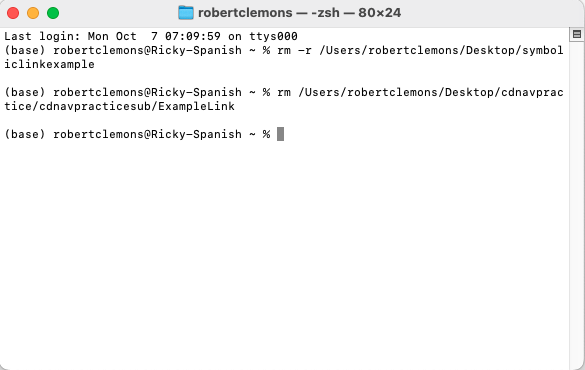

# Navigate to different directories using cd

## Introduction
Basic directory navigation is an essential skill when working in the terminal. The “cd” command which stands for "change directory" allows you to move between directories and access files or programs in different locations on your system. This section covers the simplest forms of the cd command, explaining how to navigate directly to specific directories.

## Basic Usage:

### Find Specific Directory:
This command demonstrates how to navigate to a specific directory using the full (absolute) path, which is necessary when you're not sure where you are in the file system.
- cd /Users/robertclemons/Desktop/cdnavpractice/cdnavpracticesub

### List the Contents of the Directory:
After navigating to a directory, you can use ls to list the contents of that directory
and confirm you are in the right place.
- ls /Users/robertclemons/Desktop/cdnavpractice/cdnavpracticesub

## Advanced Options:

### Switch to the Previous Directory (cd -):
Switching between directories with cd - is useful when you're frequently moving between two working directories. For example, if you’re editing files in one directory and testing code in another, cd - saves time by toggling between the two without having to retype the full paths each time. This is a very useful feature that allows you to toggle between two directories.

- cd /Users/robertclemons/Desktop/cdnavpractice 

- cd -

### Creating Symbolic Link
A symbolic link is like a shortcut that points to another directory or file. You can create it to easily access a directory without navigating the full path every time. Symbolic links act as shortcuts to directories or files. They are particularly useful when you need to access a directory or file located deep within a directory structure. By creating a symbolic link, you can place a shortcut in a more convenient location. You can easily access the original directory without typing the full path, saving you time and effort when navigating complex file systems.

- ln -s /Users/robertclemons/Desktop/symboliclinkexample /Users/robertclemons/ Desktop/cdnavpractice/cdnavpracticesub/ExampleLink

- ls -l /Users/robertclemons/Desktop/cdnavpractice/cdnavpracticesub

- cd /Users/robertclemons/Desktop/cdnavpractice/cdnavpracticesub/ExampleLink

### Navigate Through the Physical Directory, Ignoring the Symbolic Link
The -P flag forces the terminal to navigate the physical directory, ignoring symbolic links. This can be useful if you want to avoid being redirected through a symbolic link.

- cd -P /Users/robertclemons/Desktop/cdnavpractice/cdnavpracticesub/ ExampleLink

- pwd

### Remove Symbolic Link
rm -r /Users/robertclemons/Desktop/symboliclinkexample

### Remove ExampleLink Folder
rm /Users/robertclemons/Desktop/cdnavpractice/cdnavpracticesub/ExampleLink

## Common Scenarios:
This command is useful when you need to backtrack to a higher-level directory in your file structure.

### Move to the Parent Directory (cd ..)
You can move up one level in the directory structure using the .. symbol.

### Return to the Home Directory (cd ~):
Using ~ (tilde) is a shortcut to go back to your home directory, regardless of your current location.

### Navigating Multiple Levels Up (cd ../../)
You can combine multiple .. to move up several directory levels in one go.

## TASK 3 Continued: Absolute vs. Relative Path

An absolute path starts from the root of the file system and is always the same, while a relative path is based on your current location in the file system. Here’s how you would use each. Absolute paths are useful when you need to navigate to a specific directory from anywhere in the file system. They start from the root (/) and provide the full location of the directory. Relative paths, on the other hand, depend on your current location in the system. They are shorter and more convenient when you're already near your destination directory, as they save you from typing the full path.

### Scenario 1: You Are in /Users/robertclemons

### Absolute Path Example:

Let’s say you want to go to the cdnavpracticesub directory located at /Users/ robertclemons/Desktop/cdnavpractice/cdnavpracticesub. You would use the absolute path to get there, regardless of where you are in the filesystem.

- cd /Users/robertclemons/Desktop/cdnavpractice/cdnavpracticesub

### Relative Path Example:
Now, if you're already in /Users/robertclemons, and you want to go to
cdnavpracticesub, you can use a relative path. 

- cd Desktop/cdnavpractice/cdnavpracticesub

### Scenario 2: You Are in /Users/robertclemons/Desktop

### Absolute Path Example:
- First, the user uses an absolute path to go to the Desktop folder by typing: cd /Users/robertclemons/Desktop

- Then: Even though you’re already in the Desktop folder, you can still use an absolute path to get to cdnavpracticesub.

- cd /Users/robertclemons/Desktop/cdnavpractice/cdnavpracticesub

### Relative Path Example:
- First, the user uses an absolute path to go to the Desktop folder by typing:
cd /Users/robertclemons/Desktop
- Then, instead of typing the full absolute path again, the user uses a relative path to navigate to cdnavpracticesub:
cd cdnavpractice/cdnavpracticesub

## TASK4
### "No such file or directory" Error
### Issue:
This error occurs when you try to navigate to a directory that doesn't exist or you’ve made a typo in the directory name.

### Example of Bad Command:
(base) robertclemons@Ricky-Spanish ~ % cd /Users/robertclemons/Desktop/ nonexistentfolder

### This will result in:
cd: no such file or directory: /Users/robertclemons/Desktop/nonexistentfolder (base) robertclemons@Ricky-Spanish ~ %

### Solution:
Double-check the spelling and ensure that the directory actually exists by listing the contents of the parent directory.
Run “ls /Users/robertclemons/Desktop” to list the contents and confirm the directory exists. If it doesn't, double-check the spelling or navigate to a different location.

### Navigating Directories with Spaces

When directory names contain spaces, you need to take special care, as spaces can cause issues in the command line.

### Issue:
cd /Users/robertclemons/Desktop/My Folder

### Example of Bad Command:
(base) robertclemons@Ricky-Spanish ~ % cd /Users/robertclemons/Desktop/nonexistentfolder

### This will result in:
cd: string not in pwd: /Users/robertclemons/Desktop/My

### Solution:
There are two ways to handle directories with spaces:

- Use quotation marks around the path:
  cd "/Users/robertclemons/Desktop/My Folder"

- Escape the spaces with a backslash (\):
  cd /Users/robertclemons/Desktop/My\ Folder

### Clearing Terminal and Checking Your Current Location
If you’ve run several commands and the terminal is cluttered, you can clear the screen to start fresh. This doesn't affect your location, but you can use pwd afterward to confirm where you are.
### Issue:
Sometimes, you may not know where you are in the file system, which can make it difficult to understand why cdcommands aren’t working as expected.
### Solution:
Use the pwd (print working directory) command to confirm your current location:
Type: “clear” Press the “Enter” key

This will be the result:

Use the “pwd” (print working directory) command to confirm your current location:

### CONCLUSION
In conclusion, mastering the cd command is essential for effective navigation in Unix-like operating systems. From basic usage to more advanced techniques like switching between directories, using symbolic links, and troubleshooting common issues, understanding how to work with directories is a critical skill for anyone working in the terminal. With these tools, you will be able to navigate the file system efficiently, troubleshoot errors, and streamline your workflow.

### References 
https://www.linode.com/docs/guides/how-to-use-cd/
